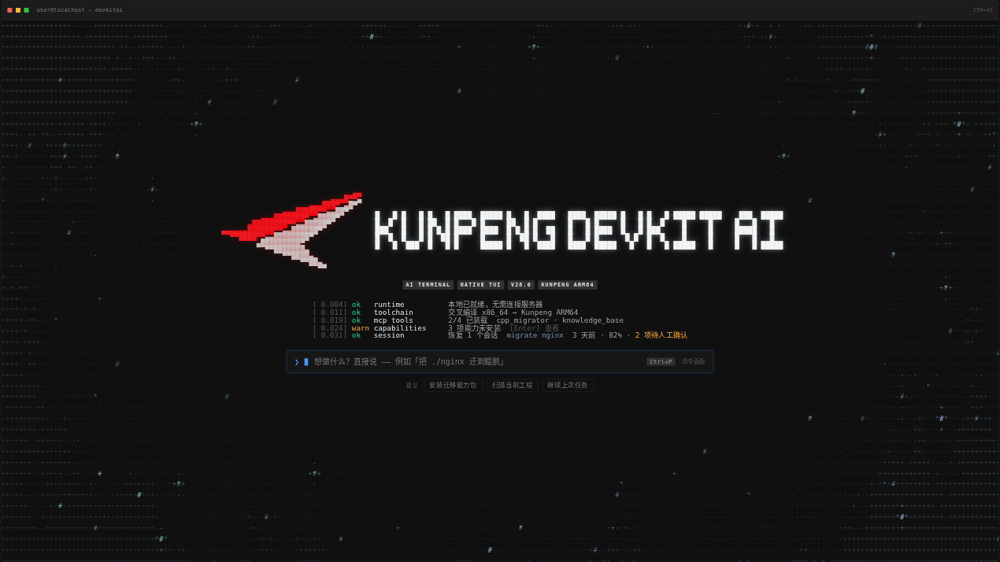
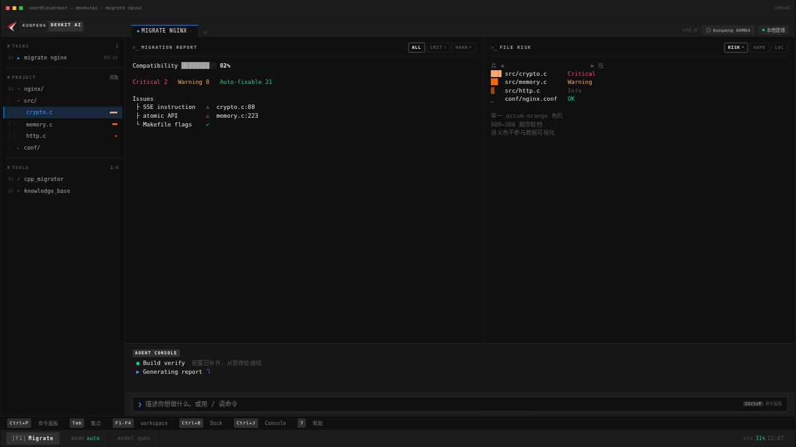
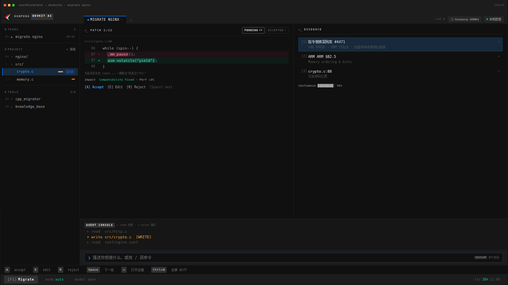
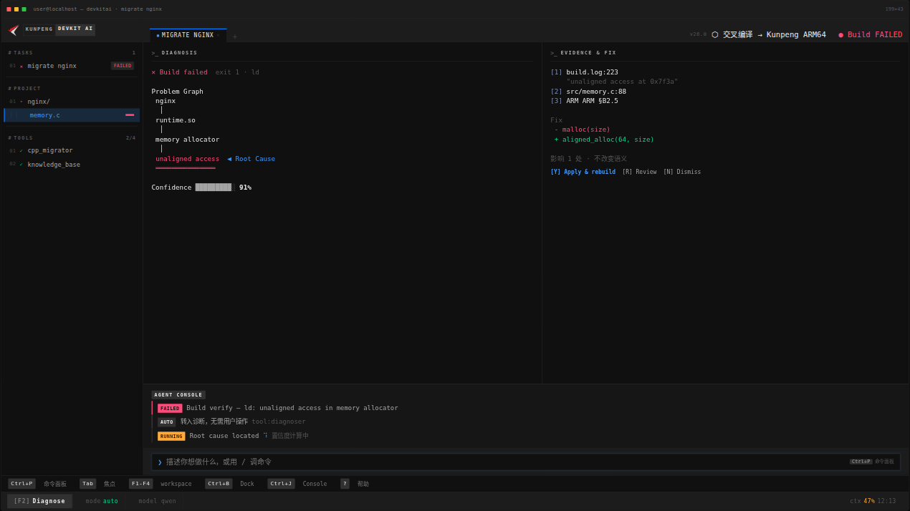
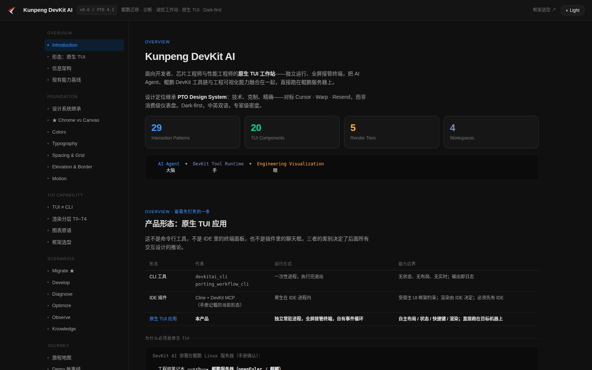

# Kunpeng DevKit AI — 原生 TUI 工作台设计规范

> 面向鲲鹏迁移 / 开发 / 诊断 / 调优的 **AI Native Terminal Engineering Workspace** 的完整设计文档集。
> 版本 0.9 · 概念设计阶段 · 2026-08



---

## 这是什么

一套把 **Kunpeng DevKit AI 做成原生 TUI 应用**的设计方案，包含产品定位、用户旅程、交互 Pattern 库、视觉系统、竞品分析和一个可点击的十幕演示。

它不是一份 PPT，而是一套面向实现的 UI 设计源材料：颜色给到预合成后的实色十六进制、组件给到 React + OpenTUI 的行为与状态契约、渲染能力给到分层降级策略、Pattern 给到编号和适用条件。用于后续实现的内容仍须汇总进正式交付，并通过人工审核。

本仓库只负责 UI 设计与正式交付，真实产品的实现仓库独立存在。正式交付入口是 [`UI-SPEC.md`](UI-SPEC.md) 和 [`pages/`](pages/)；`docs/`、`web/` 与 `assets/` 主要服务设计研究、推导和评审。

**产品形态先钉死一条**——这是**原生 TUI 应用**，不是 CLI 命令集合，不是 IDE 里的终端面板，不是聊天窗口套壳：

| 形态 | 运行方式 | 能力边界 |
|---|---|---|
| CLI 工具 | 一次性进程，执行完退出 | 无状态、无布局、无实时 |
| IDE 插件 / 内嵌终端 | 寄生在 IDE 进程内 | 受宿主 UI 约束；必须先有 IDE |
| **原生 TUI 应用** | **独立常驻进程，全屏接管终端，自有事件循环** | **自主布局 / 状态 / 快捷键 / 渲染；直接跑在目标机器上** |

理由很实在：DevKit 部署在鲲鹏 Linux 服务器上，待迁移源码、编译器、性能计数器、驱动全在那台机器上。IDE 插件方案要本地装 IDE + 挂远程开发 + 文件同步，多一层延迟，性能采集尤其失真；原生 TUI 是 ssh 上去直接 run。

---


### Web 设计稿

**在线入口 ▸ [cinnnnnnndy.github.io/DevKit](https://cinnnnnnndy.github.io/DevKit/)**

仓库根的项目启动页，把六份可交互 HTML、十一份设计规范、整套视觉 token 收在一页，点开即看（源文件 [`../index.html`](../index.html)）。

六份 HTML 也各有独立地址，可以单独打开或直接分享；它们是自包含的单文件，**下载后双击也能开**，无需构建、无需联网：

| 页面 | 在线打开 | 仓库文件 |
|---|---|---|
| **TUI 设计 demo**<br><sub>两种风格上下排列可直接对照（两者都是 TUI，差别在视觉质感）</sub> | [tui-demo.html ↗](https://cinnnnnnndy.github.io/DevKit/kunpeng-devkit-ai-tui/web/tui-demo.html) | [`web/tui-demo.html`](web/tui-demo.html) |
| ├ **风格 A · 字符质感**<br><sub>方角、1px 描边、字符网格；十幕交互演示，可自动播放或键盘切换</sub> | [demo.html ↗](https://cinnnnnnndy.github.io/DevKit/kunpeng-devkit-ai-tui/web/demo.html) | [`web/demo.html`](web/demo.html) |
| └ **风格 B · 面板质感**<br><sub>圆角卡片、描边毛玻璃、背景辉光，PTO token 配色；Agent 面板承载主标签内容</sub> | [demo-studio.html ↗](https://cinnnnnnndy.github.io/DevKit/kunpeng-devkit-ai-tui/web/demo-studio.html) | [`web/demo-studio.html`](web/demo-studio.html) |
| **设计系统**<br><sub>Design System &amp; UX Spec：token + 渲染分层 + Pattern 库 + 场景 PRD 的整合版（评审用）</sub> | [index.html ↗](https://cinnnnnnndy.github.io/DevKit/kunpeng-devkit-ai-tui/web/index.html) | [`web/index.html`](web/index.html) |
| **TUI 竞品分析**<br><sub>7 竞品 × 22 触点 × 6 阶段旅程</sub> | [competitive-analysis.html ↗](https://cinnnnnnndy.github.io/DevKit/kunpeng-devkit-ai-tui/web/competitive-analysis.html) | [`web/competitive-analysis.html`](web/competitive-analysis.html) |
| **TUI 视觉风格分析**<br><sub>五个审美流派 + 皮肤生态 + 手法清单</sub> | [visual-analysis.html ↗](https://cinnnnnnndy.github.io/DevKit/kunpeng-devkit-ai-tui/web/visual-analysis.html) | [`web/visual-analysis.html`](web/visual-analysis.html) |

几个常用深链：[设计系统 · Chrome vs Canvas ↗](https://cinnnnnnndy.github.io/DevKit/kunpeng-devkit-ai-tui/web/index.html#chrome) · [设计系统 · Colors ↗](https://cinnnnnnndy.github.io/DevKit/kunpeng-devkit-ai-tui/web/index.html#color) · [设计系统 · 渲染分层 ↗](https://cinnnnnnndy.github.io/DevKit/kunpeng-devkit-ai-tui/web/index.html#tier) · [竞品 · 机会点 ↗](https://cinnnnnnndy.github.io/DevKit/kunpeng-devkit-ai-tui/web/competitive-analysis.html#f9) · [视觉 · 我们的定位 ↗](https://cinnnnnnndy.github.io/DevKit/kunpeng-devkit-ai-tui/web/visual-analysis.html#v7)

> 站点走 Pages 的分支模式发布（Settings → Pages → Deploy from a branch），发布分支在那里指定，推上去就会自动重新构建。仓库根的 `index.html` **就是**启动页，所以站点根打开即入口；根目录的 `.nojekyll` 关掉了 Jekyll——没有它时 Pages 会拿 README 渲染成首页，点开站点根看到的是这份文档而不是启动页。六份 HTML 按仓库里的路径原样访问，在线地址与仓库路径一一对应。旧的 `/launch.html` 保留成重定向壳，之前分享出去的链接仍然有效。

<table>
<tr>
<td width="50%"><br><sub><b>④ 出报告</b> — 文件风险热力用单一色阶顺序取档，一眼定位到 crypto.c</sub></td>
<td width="50%"><br><sub><b>⑤ 审改动</b> — 每条改动都附知识库案例编号与 ARM 手册章节，可跳转验证</sub></td>
</tr>
<tr>
<td><br><sub><b>⑥ 编译翻车</b> — 失败不只报错，直接转入诊断并给修复方案</sub></td>
<td><br><sub><b>设计系统</b> — token 体系与 Pattern 库的整合版</sub></td>
</tr>
</table>

---

## 目录结构

```
.
├── README.md                        本文件
├── UI-SPEC.md                       跨仓交付的全局 UI 规范
├── pages/                           跨仓交付的页面单文件设计合同
│   └── _TEMPLATE.md                 页面详情模板
├── docs/                            UI 研究与源规范（Markdown）
│   ├── OVERVIEW.md                  产品定位 · 愿景 · 用户角色 · 信息架构
│   ├── PRD.md                       六大核心场景需求
│   ├── UX-SPEC.md                   布局 · 交互模型 · 命令体系 · 快捷键
│   ├── PATTERN.md                   交互 Pattern 库 P01–P29
│   ├── COMPONENT.md                 图表原语与组件规范
│   ├── VISUAL.md                    视觉系统：PTO Design System → TUI token 翻译 ★
│   ├── JOURNEY.md                   六阶段用户旅程 · Demo 故事线
│   ├── FRAMEWORK.md                 应用框架：MobaXterm 结构 × PTO 分割
│   ├── TUI-CAPABILITY.md            能力基线 · 渲染分层 T0–T5 · 框架选型
│   ├── COMPETITIVE-ANALYSIS.md      竞品分析（Markdown 版）
│   └── DEMO-WIREFRAME.md            四大 Demo 的 ASCII 交互稿
├── web/                             可交互 HTML（自包含单文件）
├── tools/
│   └── kpmark.py                    从标识 PNG 重采样 demo splash 的半块点阵
└── assets/                          README 用截图
```

### tools/kpmark.py

`web/demo.html` 开场画面的点阵标识由脚本从真实标识位图生成，不要手改 —— 它在
`<!-- kpmark:begin -->` / `<!-- kpmark:end -->` 之间，重跑脚本会整段覆盖。

```bash
python3 tools/kpmark.py            # 预览：终端打出点阵
python3 tools/kpmark.py --write    # 写回 web/demo.html
```

关键在于**非等比重采样**。splash 下字符格约 8.4 × 12.0 px，半块把一格纵向切两半，
所以一个"点"是 8.4 宽 × 6.0 高 —— 宽是高的 1.4 倍。按原图 1:1 取点会横向拉宽 1.4 倍。
脚本按 `cols/rows = 原图宽高比 × 12.0 / 8.4` 反算列行数，默认 25 列 × 18 行，
渲染后视觉宽高比 0.973，对标识本身的 0.978 偏差 0.5%。

只依赖标准库（zlib 解 PNG），不需要 Pillow。标识换了重跑一次即可。

`docs/VISUAL.md` 是整套里最厚的一份（570+ 行），也是最值得先读的——所有视觉决策的推导过程和被推翻的方案都记在里面。

---

## 技术栈

```
        Kunpeng DevKit AI（原生 TUI）
                 │
   PTO Design System（529 tokens · Dark-first）   ← docs/VISUAL.md
                 │
   React 19 + OpenTUI 0.5.1（组件与渲染底座）
                 │
   TypeScript 5.9 + Bun（开发与构建）
                 │
   DevKit Intelligence（MCP 工具）
   code_cpp_migrator · database_sql_migrator
   kunpeng_knowledge_base_search · profiler
```

框架选型结论：使用 **TypeScript 5.9、React 19、`@opentui/core` 0.5.1、`@opentui/react` 0.5.1 和 Bun**。

---

## 几条核心结论

这套文档里最值得单独拎出来的判断：

**Chrome 层 vs Canvas 层——结构用组件，数据用字符。** TUI 不等于"全屏都用字符拼"。框架、侧栏、标签页、输入框这些**结构性元素是真 UI 组件**，有状态层、有焦点环、有选中态；只有承载数据的画布区才回到字符渲染。这条是整套设计的分界线，早期版本没分清，导致侧栏只是一堆没有状态的文本行。

**渲染分层 T0–T5。** 从纯文本、块字符、Braille（2×4 = 8 倍密度）、真彩热力、交互，一直到终端图形协议（Kitty / Sixel / iTerm2）。每一档都要有明确的降级路径——同一个标识在 T5 走光栅、在 T1 走半块像素。

**颜色三分工。** Kunpeng 红 `#ED1C24` 只做身份（标识、NEW 标），品牌蓝 `#0077FF` 只做交互（选中、焦点、当前推荐动作），错误红 `#FF4B7B` 只做语义。判据：**看到红色时，该想到"华为鲲鹏"还是"出事了"？** 两种含义同屏出现即违规。

**强调色配额：蓝 = 当前对象，或当前唯一推荐的动作。** 其余一律中性。第一版把蓝铺到十几处，结果蓝不再指向任何东西。评审判据：遮住所有蓝色，还能说清"我现在选中的是什么"吗？能，说明蓝铺多了。

**先问"终端画得出来吗"。** 高斯模糊、自由定位、亚像素粒子——这些做出来好看但实现不了的效果一律不要，否则设计稿和实现之间会留一道永远填不平的沟。启动页因此重做过一轮：辉光换成 bloom（大半径低透明度，不能有小半径层，否则会把点阵字体的直角糊掉），背景换成字符半调场，动效换成逐帧改写字符的明灭光点。

**行业最弱环节是"审查与决策"。** 竞品分析里跑完 7 个产品 × 22 个触点后，情绪最低点落在人审查 AI 改动的那一步——**没有一个产品做到 hunk 级的接受/拒绝**。这是本产品最大的机会点。

---

## 设计系统来源

视觉继承 **PTO Design System 4.1**（529 tokens · Dark-first · Inter + JetBrains Mono），定位是技术、克制、精确——对标 Cursor / Warp / Resend，而非消费级仪表盘。

`docs/VISUAL.md` 记录了完整的 web → terminal token 翻译：六级表面、四级前景透明度预合成为实色、状态叠加层预合成、五档 highlight ramp 的顺序 vs 分类纪律、以及为什么品牌蓝会和原色板里的 copy-blue 撞色（色相差 7°，最后退役了 copy-blue 并重建了域色映射）。

上述 token 的速查版排在[设计系统页的「视觉规范速查」↗](https://cinnnnnnndy.github.io/DevKit/kunpeng-devkit-ai-tui/web/index.html#cheat) 一节——六级表面、预合成前景、状态叠加、域色映射、三条用色纪律、渲染分层 T0–T5，都能直接取色。

---

## 状态与后续

当前是 **概念设计（Concept Design）** 阶段，尚未进入实现。文档中已明确标注的待验证项：

- OpenTUI 0.5.1 在宽屏、窄屏及 SSH 低带宽场景下的局部重绘性能
- 160×50 宽屏与 58×32 窄屏布局的可用性及降级策略
- 终端图形协议（T5）在目标环境的实际可用比例
- Braille 密度渲染在中文等宽字体下的对齐表现

下一步建议按 [`docs/TUI-CAPABILITY.md`](docs/TUI-CAPABILITY.md) §6 的 **Phase 0 渲染底座先行**：先跑通 Braille 曲线 / 多核热力网格 / 可排序表三个原语，再接 MCP 客户端到 `:8000`，然后往上叠场景。若先做业务 Demo 再补渲染，大概率退化成"带框线的 CLI"。

欢迎以 Issue 形式讨论。文档中所有被推翻的方案都保留了推翻理由，改动前建议先读一眼相关章节，避免重复踩坑。

---

## 授权

内部设计资料，授权方式待定。Kunpeng 标识及华为品牌色版权归华为技术有限公司所有，本仓库仅在设计示意中引用。
